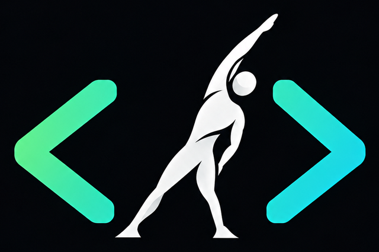

<p align="center">
  
</p>

# FitGate

<p align="center">
  <a href="https://github.com/surya-krishna/fitgate/actions/workflows/ci.yml"></a>
  <a href="https://www.npmjs.com/package/fitgate"></a>
  <a href="https://www.npmjs.com/package/fitgate"></a>
  <a href="LICENSE"></a>
  <a href="https://nodejs.org">=20.10"></a>
  <a href="../../releases"></a>
  <a href="../../stargazers"></a>
  <a href="CONTRIBUTING.md"></a>
</p>

**Make programmers healthy. One approval prompt at a time.**

FitGate intercepts the moment your AI coding agent — Claude Code, Cursor, GitHub Copilot, Codex, Gemini CLI, Windsurf and others — stops to ask you *"Do you want to proceed?"*, and gates that approval behind a 10-second-to-2-minute micro-workout: push-ups, squats, a stretch, a walk to the water cooler, a 20-20-20 eye rest.

You were about to sit and wait for the agent anyway. Now the wait makes you healthier.

This repo is the whole free product: run it forever, offline, with no account. It's open source under the [AGPL-3.0](LICENSE) — free for anyone, individuals and companies alike, with copyleft on network use. See [Why open source](#why-open-source) below.

### Install with Node.js

```
$ npm i -g fitgate
$ fitgate init

  ✔ Claude Code    hooks installed (~/.claude/settings.json)
  ✔ Cursor         hooks installed (~/.cursor/hooks.json)
  ✔ Copilot CLI    hooks installed (~/.copilot/hooks/fitgate.json)
  ✔ Codex CLI      hooks installed (~/.codex/hooks.json)
  ✔ MCP server     registered for 4 agents
  ✔ daemon         running at http://127.0.0.1:4820

  Next time an agent asks for approval, you'll get a micro-workout first.
```

### Install with no Node.js (standalone binary)

Every [release](../../releases) publishes a self-contained `fitgate` executable for Windows, macOS (Intel + Apple Silicon) and Linux — Node.js is bundled inside, nothing else to install:

```bash
# macOS / Linux — download the archive for your platform from Releases, then:
tar -xzf fitgate-<platform>.tar.gz
chmod +x fitgate
./fitgate init

# Windows — unzip fitgate-windows-x64.zip, then from PowerShell:
.\fitgate.exe init
```

Put the binary on your `PATH` (e.g. `/usr/local/bin` or a folder already in `PATH` on Windows) so agent hooks can find it by the bare name `fitgate`. These binaries are built with Node's [Single Executable Applications](https://nodejs.org/api/single-executable-applications.html) feature — see `packages/cli/scripts/build-sea-*.mjs` and `.github/workflows/release-binaries.yml` if you want to build your own.

## How it works

1. **Intercept.** Every supported agent has a lifecycle hook that fires right before it shows you a permission prompt. `fitgate init` installs a hook that runs `fitgate gate` there. Agents without hooks get an MCP tool and a rules snippet instead. Full details per agent in [docs/AGENT-INTEGRATIONS.md](docs/AGENT-INTEGRATIONS.md).
2. **Gate.** The hook asks the local daemon for a micro-task. A notification pops, a tiny web page opens: *"10 bodyweight squats. Feet shoulder-width, sit back, knees over toes."* You do them, press **Done**, and the agent's normal approval prompt appears. The hook never sees your code — only the tool name and a one-line summary reach the daemon, and only on localhost.
3. **Pace.** A cooldown (default 20 min) and a daily cap (default 12) mean gates arrive at a habit-forming rhythm, not on every `ls`. Quiet hours, pause, and skip exist because life happens. FitGate **always fails open** — a bug in FitGate never blocks your work.
4. **Personalise (optional).** Pair with a FitGate server (self-hosted or FitGate Cloud, a separate repo) to get an LLM-drafted plan inside a deterministic safety envelope, a clinician review link, and a dashboard. Without a server, FitGate uses a conservative built-in pool of bodyweight and mobility tasks and keeps everything on your machine.

## Supported agents

| Agent | How | Reliability |
|---|---|---|
| Claude Code | `PermissionRequest` hook | ★★★ fires exactly at the approval prompt |
| Cursor | `beforeShellExecution` / `beforeMCPExecution` hooks | ★★★ |
| GitHub Copilot CLI | `preToolUse` hook | ★★★ |
| OpenAI Codex CLI | `PermissionRequest` hook | ★★★ |
| Gemini CLI | `BeforeTool` hook | ★★ before each shell/write tool (cooldown paces it) |
| Windsurf (Devin Desktop) | `pre_run_command` / `pre_write_code` / `pre_mcp_tool_use` | ★★ |
| Augment, Kiro, Amp, Cline | native hooks / permission helpers | ★★ |
| opencode, Roo Code, Aider, Zed, anything with MCP | `fitgate_gate` MCP tool + rules snippet | ★ depends on the model following instructions |
| anything with a `(y/n)` prompt | `fitgate wrap -- <cmd>` (experimental) | ★ |

Adding an agent is one file — see [Contributing](#contributing).

## Repository layout

```
packages/cli       fitgate — the CLI, hooks, local daemon, gate UI, MCP server
packages/shared     zod schemas, contracts, the built-in micro-task pool
packages/llm        OpenRouter → Gemini → OpenAI provider chain, plan generator
docs/               architecture, agent integrations, health & safety, roadmap
```

## Quick start (developers)

```bash
pnpm install
pnpm build:packages            # shared, llm, cli
pnpm --filter fitgate test     # end-to-end hook simulation included
node packages/cli/dist/index.js init --yes   # or: npm link in packages/cli

# optional: build a standalone binary for your own OS (no Node needed to run it)
pnpm --filter fitgate build:sea:bundle
pnpm --filter fitgate build:sea    # → packages/cli/dist-sea/fitgate(.exe)
```

## Why open source

The interceptor is the whole growth engine — the more places it runs, the more programmers stay healthy. So it's genuinely open source under the AGPL-3.0: run it forever, for free, offline, at home or at work, embed it anywhere, no account and no strings. Use it inside your company all you like.

The AGPL's copyleft is what keeps improvements in the commons: if you modify FitGate and let others use your version over a network, you owe those users your source. That obligation is the only string attached, and it's aimed at people who would take the work private — not at people using it.

If your organisation wants to build on FitGate without the copyleft obligation, we sell commercial licenses; that revenue funds the free version. Contact Adroytz Technology Services LLP at <krish.surya99@gmail.com>. Dual licensing is also why contributions are covered by a [CLA](CLA.md).

FitGate Cloud (hosted, optional) is a separate server built on the same core — see [docs/ARCHITECTURE.md](docs/ARCHITECTURE.md) for where the boundary sits.

## Contributing

The community is the product here as much as the code — every agent connector, safe exercise, or bug fix someone contributes makes the whole tribe of programmers using this healthier, not just the person who wrote it. See [CONTRIBUTING.md](CONTRIBUTING.md).

## Not medical advice

FitGate is a habit tool, not a medical device. The built-in task pool is conservative bodyweight/mobility work; personalised plans (when paired with a server) are drafts constrained by conservative rules and meant to be reviewed by a licensed clinician before use. Stop any exercise that causes pain, dizziness or chest discomfort and seek medical care. See [docs/HEALTH-SAFETY.md](docs/HEALTH-SAFETY.md).

## License

Copyright (c) 2026 Adroytz Technology Services LLP.

FitGate is free and open source software under the **[GNU Affero General Public License v3.0](LICENSE)** — free to use, run, modify and share, for anyone, commercial use included. If you run a modified version as a network service, AGPL section 13 requires you to offer your users the corresponding source.

Commercial licenses without the copyleft obligation are available from Adroytz Technology Services LLP — <krish.surya99@gmail.com>. Contributions are licensed under the [CLA](CLA.md).
"# fitgate" 
